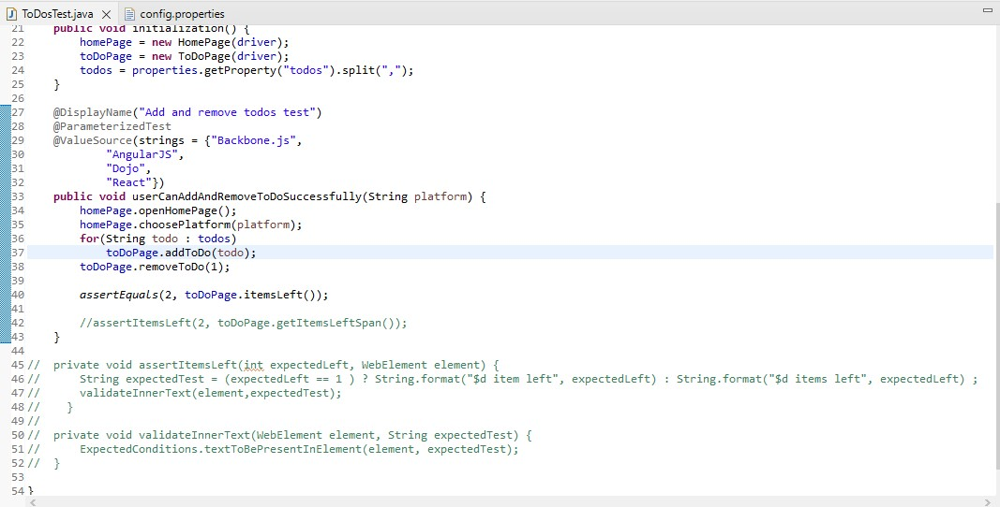

### TP n° 3 en Qualité Logicielle
<h1 align=center >
  JUnit with Selenium
</h1>

This project tests some of https://todomvc.com/ website features (adding and removing todos on different platforms) using Selenium as a test automation tool and JUnit as a unit testing framework.

We will be testing the following scenario :
- User chooses a platform
- User adds some todos
- User removes some todos

The code that runs this scenario will be the following :

  

Tests reports will be generated using ***Surefire plugin***.

***Page Object Pattern*** is applied in this project to get a **cleaner code**.
