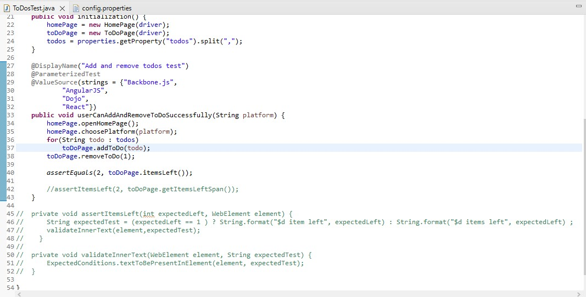

# 🧪 TP n° 3 – Software Quality: JUnit with Selenium

<h1 align="center">
  🧼 Automated UI Testing on ToDoMVC using JUnit & Selenium
</h1>

This project is developed as part of **Software Quality**.  
It demonstrates how to perform UI automation testing on the [ToDoMVC](https://todomvc.com/) web application using **Selenium WebDriver** and **JUnit 5**.

---

## 📌 Test Scenario

This project automates the following test flow:

- ✅ User chooses a frontend platform (e.g., AngularJS, Backbone.js)
- ✅ User adds multiple todos
- ✅ User removes some todos
- ✅ Assertions are made to validate the UI state

<p align="center">
  
</p>

---

## ⚙️ Tech Stack

| Component            | Usage                             |
|----------------------|-----------------------------------|
| **JUnit 5**          | Testing framework                 |
| **Selenium WebDriver** | UI automation                   |
| **WebDriverManager** | Driver management (Chrome, etc.)  |
| **Maven Surefire**   | Test execution & report generation |
| **Page Object Pattern** | Clean and maintainable code     |

---

## 🚀 Getting Started

### ▶️ Prerequisites
- Java 8+
- Maven 3.6+
- Chrome or compatible browser

### ▶️ Run Tests

```bash
mvn test
